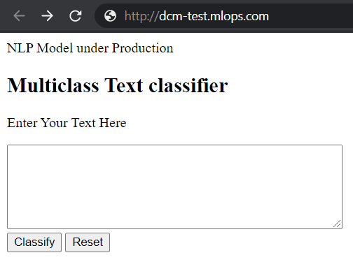
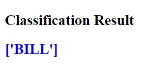

# Document Classification Model

The given Data has been classified into 14 classes. The Data has been factorized by 0 to 13 to be represented numerically instead of the text values. The Data has been sampled and reshuffeled, the minimum categorized data is 230. The data has been trained and the test plate is 75 and 25 respectively.

The vectorized variables used are as follows:

- sublinear_tf - is set to be true for a logarithmic form of frequency 
- min_df - minimum number of documents a word must be present to keep
- norm - is set to l2 to ensure all our feature vector to have an euclidean norm of 1 
- ngram_range - is set for unigram and bigram 

The Data has been trained using the NLP model. The test data scores are 70% to 71% because there are critical values like bill binder and binder which have very narrow differences where machine cannot predict with accuracy. These three policies dragged the accuracy down. We can improve the accuracy by using the n sample way which helps us determine the accuracy to the max value. 


## Deployment 

Infrastructure for running Document Classification Model(DCM) in AWS. We are running ECS Fargate cluster for DCM. 

### Features
* Create a Security Group, IAM roles for cluster
* Create a ECS Fargate Cluster for DCM
* Create a Task Definition with DCM image inside container definition
* Create a Service for Fargate DCM cluster
* Create an ALB
* Configure Route 53

### Flow
Build Docker file and push to ECR
Deploy Terraform ECS Fargate cluster for Document Classification Model(DCM) in AWS

### Usage
```
$ terraform init
$ terraform plan
$ terraform apply
```
### UI Output



